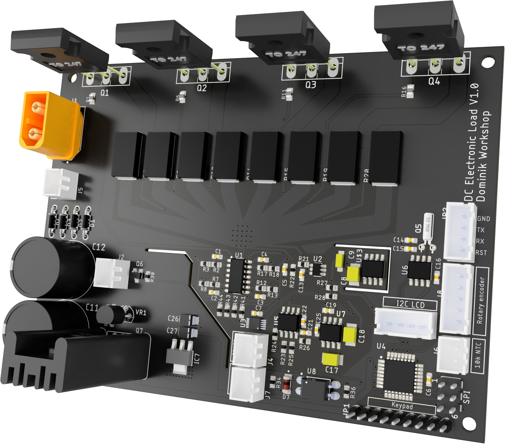
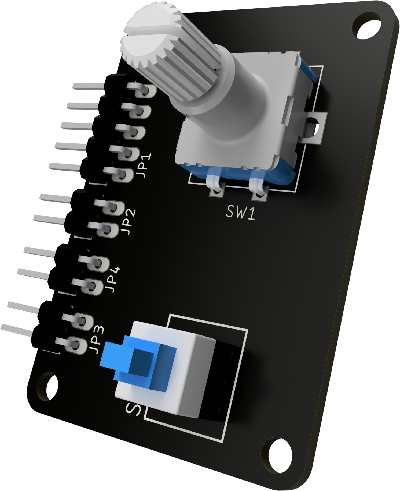
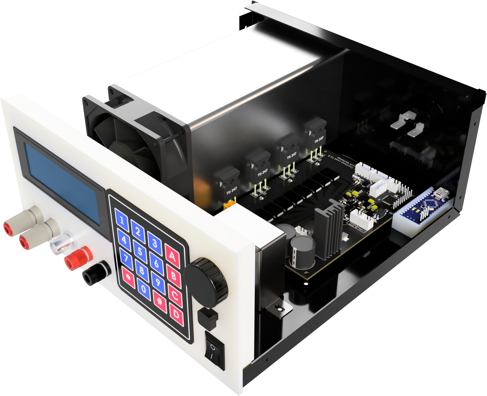
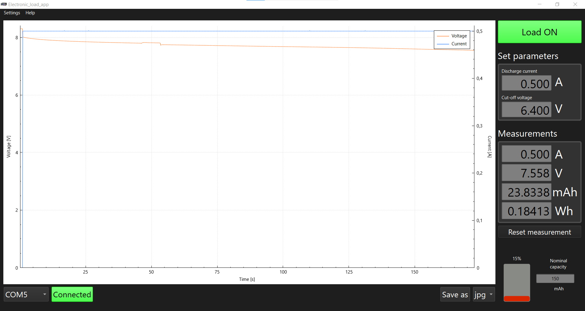

# DC Electronic load

### More info about this project can be found on my channel: 
 https://youtu.be/NScaRQj53l0

## Used tools:
 &nbsp;&nbsp;&nbsp;&nbsp; &nbsp;&nbsp;&nbsp;&nbsp; 
 &nbsp;&nbsp;&nbsp;&nbsp; &nbsp;&nbsp;&nbsp;&nbsp; 
 &nbsp;&nbsp; &nbsp;&nbsp;&nbsp;&nbsp; 

## Project status: :heavy_check_mark: ready for construction!
The project is poised for construction and operational use. However, ongoing development persists, addressing minor bug fixes and introducing new features. Stay tuned for updates!

## Project overview
Commercially available electronic loads often come with a hefty price tag, so I decided to build my own. 
This project was inspired by many electronic loads, with the primary inspiration being Scullcom's Electronic DC Load. You can view it [here](https://www.youtube.com/watch?v=9fsf1CgnTRk&list=PLUMG8JNssPPzbr4LydbTcBrhoPlemu5Dt&ab_channel=ScullcomHobbyElectronics).

 
&nbsp;&nbsp;&nbsp; 
 

### Project goals:
- **300 W power dissipation**

- **up to 8A and 50V** (obeying the 300W limit)

- **Remote voltage sensing option**

- **Easy to input values:** you can use an encoder as well as a keypad

- **5 modes of operation**
  - **Constant current mode**

  - **Constant power mode**

  - **Constant resistance mode**

  - **Transient response mode**

  - **Battery testing mode**

- **Nice to look at:** doesn't look like a poor DIY build

## Electronics:
### Block diagram

### PCBs:
- Main board: responsible for main funcionalities of the load

 

- Front board: responsible for user input with the rotary encoder and switching the voltage measurement circuitry between the main and sense terminals

   

## Mechanical construction:
The case for this project is made with 1mm thick bent sheet metal, with a 3D printed front panel.

 
 

## PC remote controll battery mode app
 
The app is currently available for Windows only. To run it, simply double-click on

`\desktop_app\release\windows-64bit\electronic_load_control_app.exe`

## Accuracy measurements

Click to learn more

The precision of the electronic load's current and voltage measurements, as well as its set current accuracy, were tested against the `Sanwa PC7000` multimeter. The following tables present the results of these measurements.

### Accuracy of set and measured current values

| Set Value [A] | Load Measurement [A] | Multimeter Measurement [A]  |
|:--------------|:---------------------|:----------------------------|
| 0.1           | 0.104                | 0.1032 ± 0.0029             |
| 0.2           | 0.203                | 0.2024 ± 0.0037             |
| 0.3           | 0.300                | 0.3000 ± 0.0044             |
| 0.4           | 0.406                | 0.4051 ± 0.0053             |
| 0.5           | 0.500                | 0.4997 ± 0.0060             |
| 0.6           | 0.602                | 0.6020 ± 0.0069             |
| 0.7           | 0.702                | 0.7020 ± 0.0077             |
| 0.8           | 0.800                | 0.8000 ± 0.0084             |
| 0.9           | 0.904                | 0.9038 ± 0.0093             |
| 1.0           | 1.007                | 1.0065 ± 0.0101             |
| 2.0           | 2.007                | 2.0070 ± 0.0181             |
| 3.0           | 3.006                | 3.0057 ± 0.0261             |
| 4.0           | 4.003                | 4.0022 ± 0.0341             |
| 5.0           | 5.002                | 5.0007 ± 0.0421             |
| 6.0           | 6.001                | 5.996 ± 0.068               |
| 7.0           | 6.998                | 6.997 ± 0.076               |
| 8.0           | 7.998                | 7.990 ± 0.084               |

### Accuracy of voltage measurements

| Load Measurement [V] | Multimeter Measurement [V] |
|:---------------------|:---------------------------|
| 1.002                | 1.0022 ± 0.0006            |
| 2.002                | 2.0029 ± 0.0009            |
| 3.004                | 3.0043 ± 0.0012            |
| 4.004                | 4.0039 ± 0.0015            |
| 5.006                | 5.0058 ± 0.0018            |
| 8.004                | 8.004 ± 0.006              |
| 10.01                | 10.007 ± 0.007             |
| 12.01                | 12.008 ± 0.007             |
| 14.01                | 14.010 ± 0.008             |
| 16.01                | 16.004 ± 0.009             |
| 18.01                | 18.007 ± 0.010             |
| 20.01                | 20.008 ± 0.011             |
| 25.01                | 25.011 ± 0.013             |
| 30.02                | 30.016 ± 0.015             |
| 35.02                | 35.019 ± 0.017             |
| 40.02                | 40.019 ± 0.019             |
| 45.02                | 45.023 ± 0.021             |
| 50.01                | 50.012 ± 0.023             |

### Conclusion: ✅

The current values measured by the electronic load did not deviate from the set value by more than **7 mA**. All measurements taken by the electronic load are within the range of values measured by the multimeter, considering the multimeter's measurement error.

## Uploading the code using USBASP

Click to learn more

Add the following code to the `platformio.ini` file

    upload_protocol = custom
    upload_port = usb
    upload_flags = 
        -C
        ${platformio.packages_dir}/tool-avrdude/avrdude.conf
        -p
        $BOARD_MCU
        -P
        $UPLOAD_PORT
        -c
        usbasp
    upload_command = avrdude $UPLOAD_FLAGS -U flash:w:$SOURCE:i

Uploading the code this way will reduce the boot up time.

**Note:** Since this method removes the bootloader, in order to program the uC via UART next time, you have to burn the bootloader.

## What could be improved in the next version:
  - Add reverse polarity protection
  - Higher resolution DAC

## Special thanks

Special thanks to [**Eryk Możdzeń**](https://github.com/Eryk-Mozdzen), who helped solving a software problem with a memory leak.
