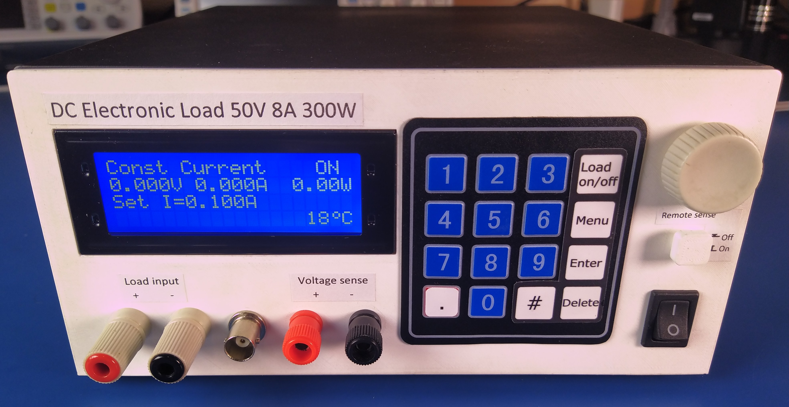
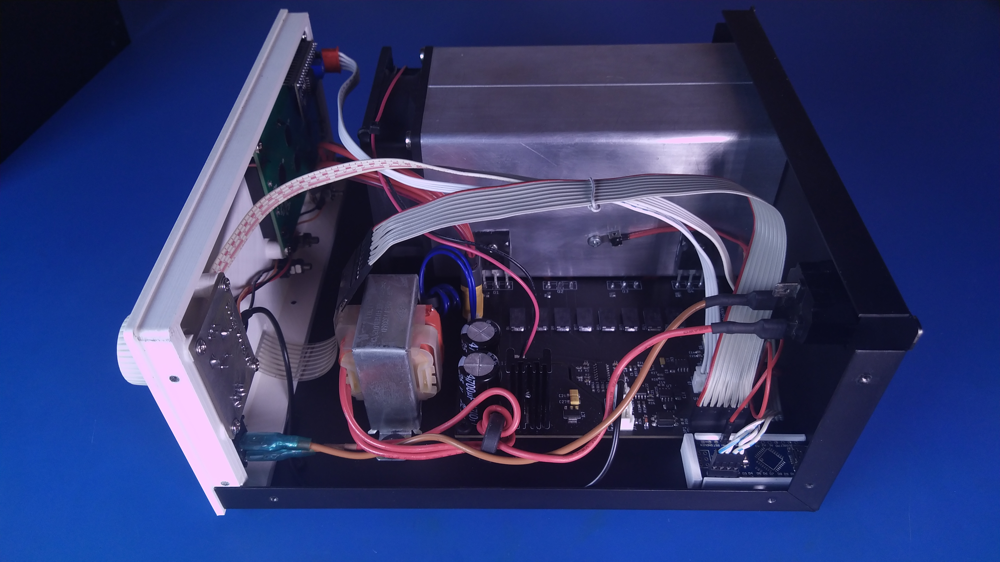
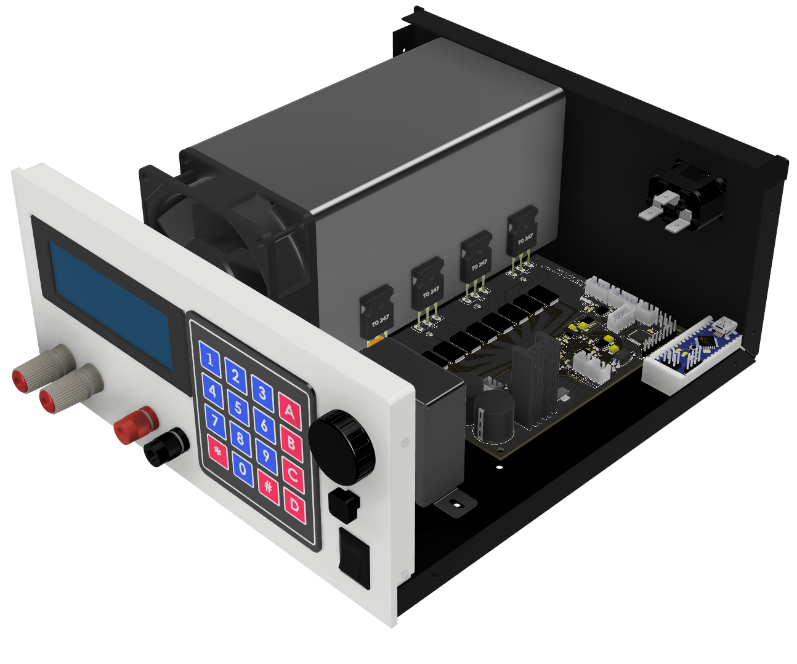
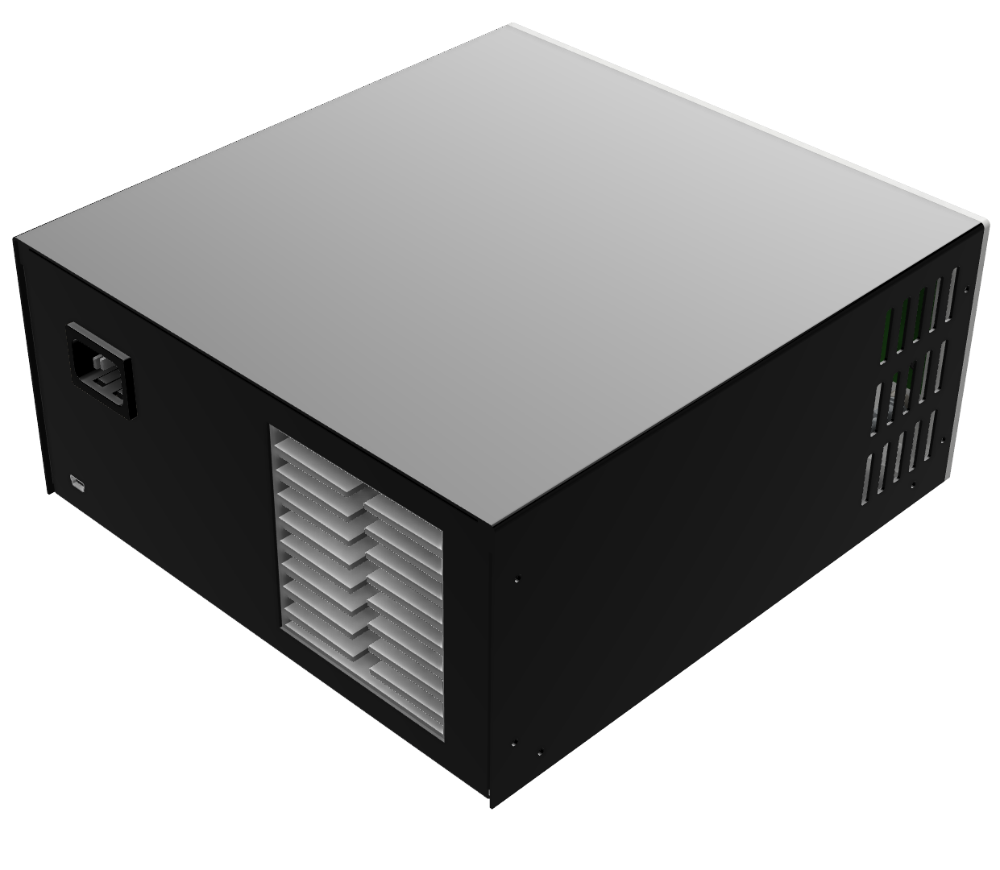

# DC Electronic load

### More info about this project can be found on my channel: 
 https://youtu.be/NScaRQj53l0

## Project status: :heavy_check_mark: ready for construction!
The project is poised for construction and operational use. However, ongoing development persists, addressing minor bug fixes and introducing new features. Stay tuned for updates!

## Project overwiev
Commercially available electronic loads often come with a hefty price tag, so I decided to build my own.

 
 

### Project Goals:
- **300 W power dissipation**

- **up to 8A and 50V** (obeying the 300W limit)

- **Remote voltage sensing option**

- **Easy to input values:** you can use an encoder as well as a keypad

- **5 modes of operation**
  - **Constant current mode**

  - **Constant power mode**

  - **Constant resistance mode**

  - **Transient response mode**

  - **Battery testing mode**

- **Nice to look at:** doesn't look like a poor DIY build

## Electronics:
There are two PCBs:
- Main board: responsible for main funcionalities of the load

 

- Front board: responsible for user input with the rotary encoder and switching the voltage measurement circuitry between the main and sense terminals

 

## Mechanical construction:
The case for this project is made with 1mm thick bent sheet metal, with a 3D printed front panel.

 
 

### Uploading the code using USBASP
add following code to the platformio.ini file

    upload_protocol = custom
    upload_port = usb
    upload_flags = 
        -C
        ${platformio.packages_dir}/tool-avrdude/avrdude.conf
        -p
        $BOARD_MCU
        -P
        $UPLOAD_PORT
        -c
        usbasp
    upload_command = avrdude $UPLOAD_FLAGS -U flash:w:$SOURCE:i

Uploading the code this way will reduce the boot up time.

Note: since this method removes the bootloader, in order to program the uC via UART next time,
    you have to burn the bootloader.

## Used tools:
 &nbsp;&nbsp;&nbsp;&nbsp; &nbsp;&nbsp;&nbsp;&nbsp; 
 &nbsp;&nbsp;&nbsp;&nbsp; &nbsp;&nbsp;&nbsp;&nbsp; 

#

## What could be improved in the next version:
  - Add reverse polarity protection
  - Higher resolution DAC

## Special thanks

Special thanks to [**Eryk Możdzeń**](https://github.com/Eryk-Mozdzen), who helped solving a software problem with a memory leak.
